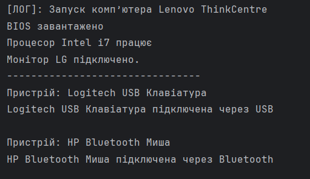

### Лабораторна робота №4.
## Тема: Розробка структури класів з урахуванням зазначеної предметної області.

# Завдання:

В програмі показати використання внутрішніх(inner), вкладених(staticnested) та локальних класів. Показати зв'язки між класами: асоціація, композиція, агрегація.
Реалізувати мінімальну взаємодію між екземплярами класів.
8. Компоненти комп'ютера.

# Результат виконання програми

# Діаграма

